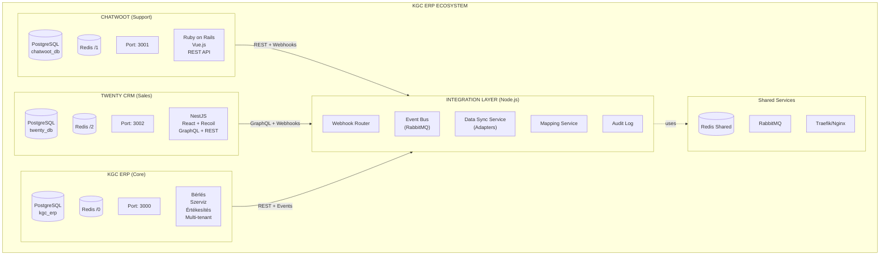
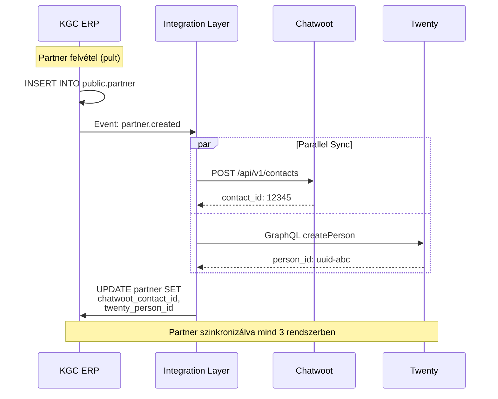
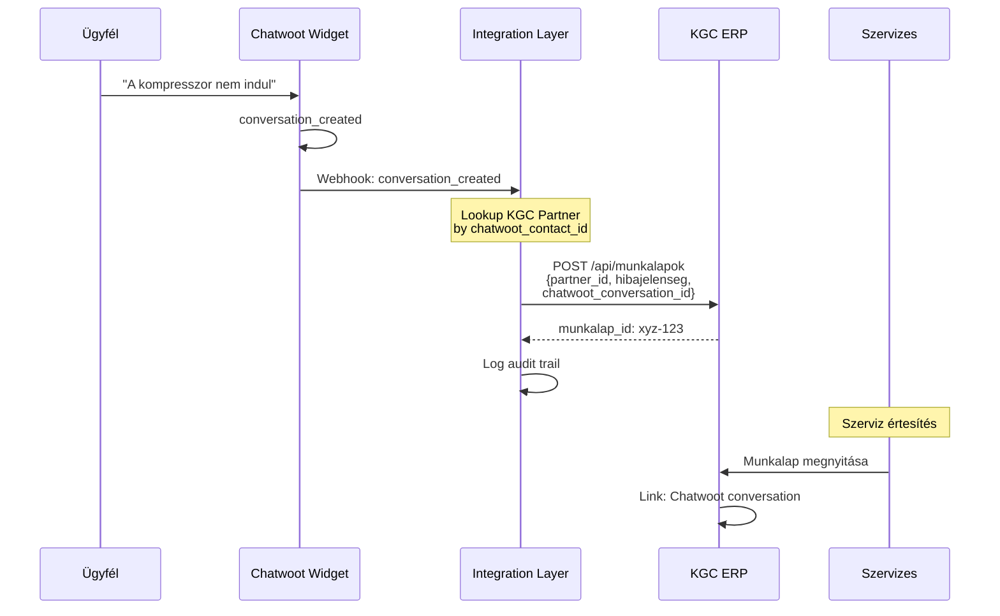
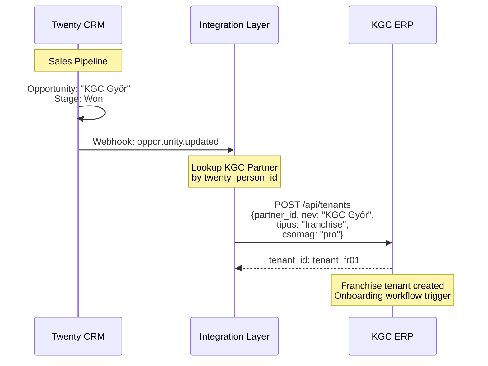
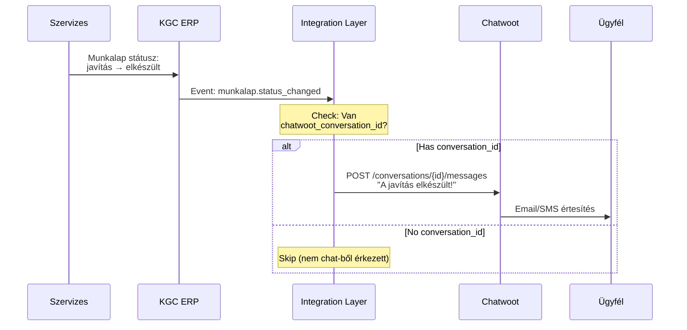
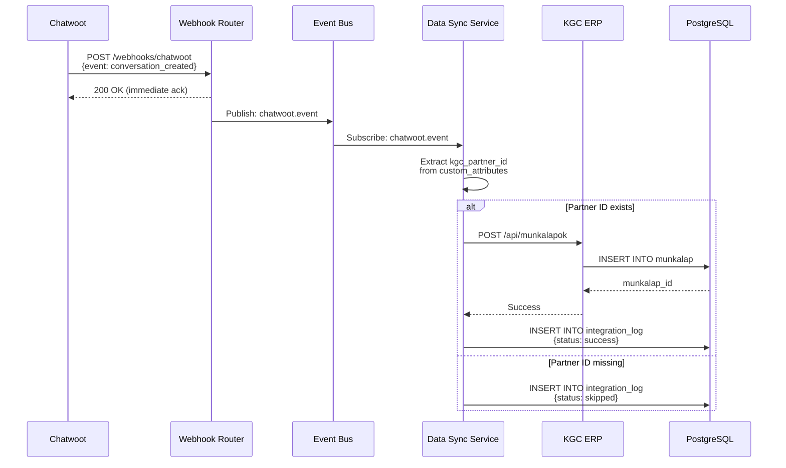
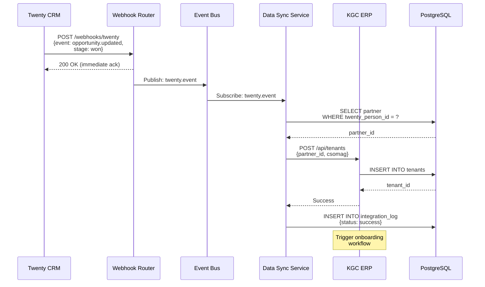
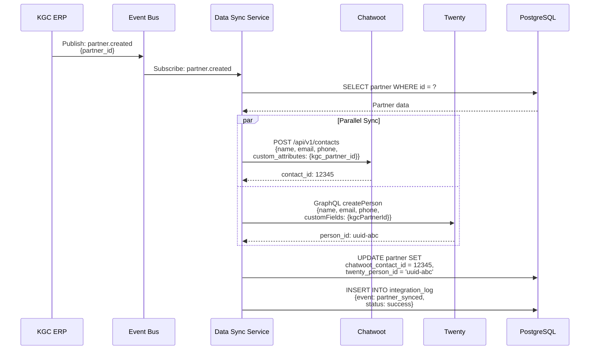
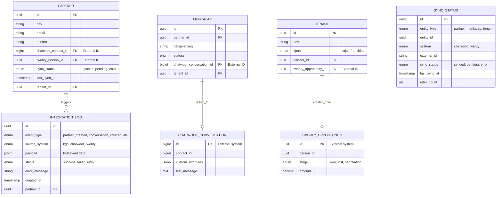
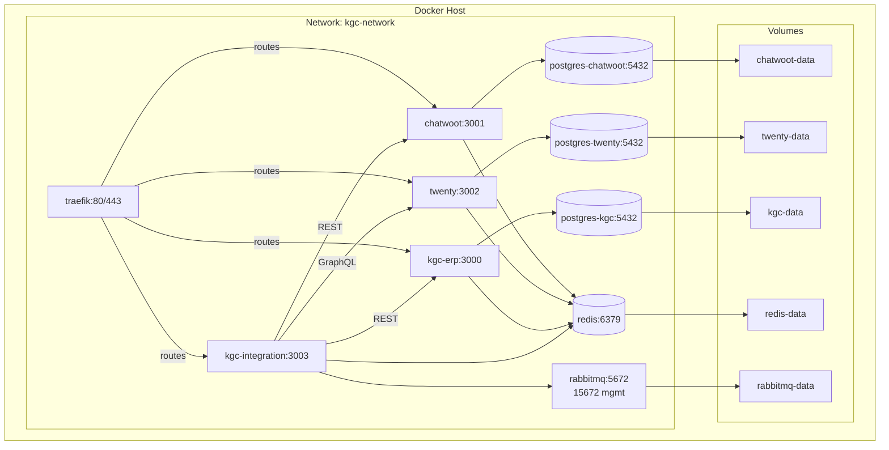

# KGC ERP Integration Diagrams

**Dátum:** 2025-12-19
**Kapcsolódó:** ADR-015 (CRM Support Integration Strategy)

---

## 1. Rendszer Architektúra Diagram

**Fájl:** [integration-system-architecture.excalidraw](integration-system-architecture.excalidraw)



---

## 2. Adatfolyam Diagram (Data Flow)

### Use Case A: Partner Szinkronizáció



### Use Case B: Support Ticket → Szerviz Munkalap



### Use Case C: Sales Opportunity → Franchise Tenant



### Use Case D: Munkalap Státusz → Chatwoot Értesítés



---

## 3. Sequence Diagram - Webhook Interactions

### Chatwoot → KGC (Conversation Created)



### Twenty → KGC (Opportunity Won)



### KGC → Chatwoot/Twenty (Partner Created)



---

## 4. Entity Relationship Diagram (Integration Tables)



### Táblák Leírása

#### public.partner (KGC Master)
- **chatwoot_contact_id**: Chatwoot Contact.id
- **twenty_person_id**: Twenty Person.id
- **sync_status**: enum ('synced', 'pending', 'error')
- **last_sync_at**: Utolsó sikeres szinkronizáció

#### integration_log (Audit Trail)
- **event_type**: 'partner_created', 'conversation_created', 'opportunity_won', stb.
- **source_system**: 'kgc', 'chatwoot', 'twenty'
- **payload**: JSONB (teljes event adat)
- **status**: 'success', 'failed', 'retry'
- **Retention**: 7 év (compliance)

#### tenant_xxx.munkalap
- **chatwoot_conversation_id**: Link Chatwoot conversation-höz (opcionális)
- Ha NULL → Nem chat-ből érkezett

#### sync_status (Optional - Advanced)
- Finomabb szinkronizáció tracking entitásonként
- Retry logic kezelés
- System-specifikus external ID-k

---

## 5. Deployment Diagram (Docker Compose)



### Docker Compose Konfiguráció

```yaml
version: '3.8'

services:
  # === Applications ===
  chatwoot:
    image: chatwoot/chatwoot:latest
    ports:
      - "3001:3000"
    environment:
      POSTGRES_HOST: postgres-chatwoot
      REDIS_URL: redis://redis:6379/1
    depends_on:
      - postgres-chatwoot
      - redis
    networks:
      - kgc-network

  twenty:
    image: twentycrm/twenty:latest
    ports:
      - "3002:3000"
    environment:
      PG_DATABASE_URL: postgresql://twenty@postgres-twenty:5432/twenty
      REDIS_URL: redis://redis:6379/2
    depends_on:
      - postgres-twenty
      - redis
    networks:
      - kgc-network

  kgc-erp:
    image: kgc-erp:latest
    ports:
      - "3000:3000"
    environment:
      DATABASE_URL: postgresql://kgc@postgres-kgc:5432/kgc_erp
      REDIS_URL: redis://redis:6379/0
    depends_on:
      - postgres-kgc
      - redis
    networks:
      - kgc-network

  kgc-integration:
    image: kgc-integration:latest
    ports:
      - "3003:3000"
    environment:
      KGC_API_URL: http://kgc-erp:3000
      CHATWOOT_API_URL: http://chatwoot:3001
      TWENTY_API_URL: http://twenty:3002
      RABBITMQ_URL: amqp://rabbitmq:5672
    depends_on:
      - kgc-erp
      - chatwoot
      - twenty
      - rabbitmq
    networks:
      - kgc-network

  # === Databases ===
  postgres-chatwoot:
    image: postgres:15
    volumes:
      - chatwoot-data:/var/lib/postgresql/data
    networks:
      - kgc-network

  postgres-twenty:
    image: postgres:15
    volumes:
      - twenty-data:/var/lib/postgresql/data
    networks:
      - kgc-network

  postgres-kgc:
    image: postgres:15
    volumes:
      - kgc-data:/var/lib/postgresql/data
    networks:
      - kgc-network

  # === Shared Services ===
  redis:
    image: redis:7-alpine
    volumes:
      - redis-data:/data
    networks:
      - kgc-network

  rabbitmq:
    image: rabbitmq:3-management
    ports:
      - "15672:15672"  # Management UI
    volumes:
      - rabbitmq-data:/var/lib/rabbitmq
    networks:
      - kgc-network

  traefik:
    image: traefik:v2.10
    command:
      - "--api.insecure=true"
      - "--providers.docker=true"
    ports:
      - "80:80"
      - "443:443"
      - "8080:8080"  # Dashboard
    volumes:
      - /var/run/docker.sock:/var/run/docker.sock
    networks:
      - kgc-network

networks:
  kgc-network:
    driver: bridge

volumes:
  chatwoot-data:
  twenty-data:
  kgc-data:
  redis-data:
  rabbitmq-data:
```

### Port Mapping

| Service | Internal Port | External Port | Purpose |
|---------|---------------|---------------|---------|
| Chatwoot | 3000 | 3001 | Support platform |
| Twenty | 3000 | 3002 | CRM platform |
| KGC ERP | 3000 | 3000 | Core ERP |
| Integration Layer | 3000 | 3003 | Webhook router + sync |
| RabbitMQ Management | 15672 | 15672 | Message queue UI |
| Traefik Dashboard | 8080 | 8080 | Proxy dashboard |

### Network Isolation

- **kgc-network**: Izolált Docker bridge network
- Alkalmazások csak ezen belül kommunikálnak
- External hozzáférés csak Traefik-en keresztül (TLS termination)

---

## Diagram Használati Útmutató

### Excalidraw Megnyitása

1. Töltsd le az Excalidraw desktop app-ot: https://excalidraw.com
2. Nyisd meg a `.excalidraw` fájlt
3. Szerkeszd igény szerint

### Mermaid Diagramok Renderelése

**VS Code Extension:**
```bash
# Install Mermaid Preview extension
code --install-extension bierner.markdown-mermaid
```

**Online Editor:**
- https://mermaid.live

**Markdown Preview:**
- GitHub automatikusan rendereli a mermaid blokkokat
- GitLab is támogatja

### Diagramok Frissítése

**Ha változik az architektúra:**
1. Frissítsd a Mermaid kódot (egyszerűbb)
2. Generálj újra PNG/SVG exportot (ha kell)
3. Commit mindkét fájlt (`.md` és `.excalidraw`)

**Verziókövetés:**
- Git diff működik `.md` fájlokon
- `.excalidraw` JSON - nehezebb diff, de human-readable

---

## Kapcsolódó Dokumentumok

| Dokumentum | Elérési út |
|------------|------------|
| ADR-015: Integration Strategy | [ADR-015-CRM-Support-Integration-Strategy.md](../../architecture/ADR-015-CRM-Support-Integration-Strategy.md) |
| KGC PRD | [prd.md](../../prd.md) |
| Moduláris Architektúra | [ADR-014-modular-architektura-vegleges.md](../../architecture/ADR-014-modular-architektura-vegleges.md) |

---

**Készült:** 2025-12-19
**Státusz:** Végleges
