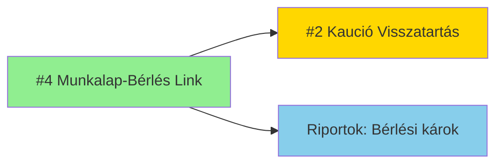

# Feature Architektúra: Munkalap-Bérlés Direkt Kapcsolat

**Feature ID:** FIT-GAP-004
**Prioritás:** 🔴 KRITIKUS
**Komplexitás:** 🟢 ALACSONY (2-3 SP)
**Típus:** ⚠️ MINOR GAP - Közvetett kapcsolat javítása direktre
**Verzió:** 1.0
**Dátum:** 2025-12-29
**Architect:** Winston 🏗️

---

## 📋 Executive Summary

A jelenlegi KGC ERP rendszerben a **bérléshez kapcsolódó szerviz munkák** csak közvetetten azonosíthatók (BÉRLÉS → CIKK ← MUNKALAP). Ez megnehezíti:
- A bérlés során felmerült károk követését
- A kaució visszatartáshoz kapcsolódó munkalapok azonosítását
- A bérlési lezárás vezérlését (nyitott munkalap esetén)

**Megoldás:** Direkt FK kapcsolat (`MUNKALAP.berles_id → BÉRLÉS.id`) hozzáadása és a munkalap típusok bővítése.

### Üzleti Érték
- ✅ **Gyors lekérdezhetőség:** "Mutasd a #BER-12345 bérléshez tartozó javításokat" (1 query)
- ✅ **Adatintegritás:** Cascade delete védelem (bérlés nem törölhető nyitott munkalappal)
- ✅ **Riportok:** Bérlési káresemények, költségek, átlagos javítási idő
- ✅ **#2 Kaució visszatartás** követelmény alapja (dependency)

### Technikai Hatás
- **Entitás módosítás:** 1 tábla (MUNKALAP) - 2 új mező
- **Folyamat módosítás:** 04-szerviz-folyamat.md (1 új lépés)
- **UI módosítás:** Munkalap felvételi képernyő (1 új opció)
- **Breaking change:** ❌ Nincs - backward compatible (nullable FK)

---

## 🎯 Követelmény Részletezés

### Forrás
**Fit-Gap Analízis:** `/docs/KGC-ERP-v3-Fit-Gap-Analízis-2025-12-29.md` - Követelmény #4
**Transcript:** `KGC-notes-2025-12-16-01.md`, sor 386-423

### Idézet (üzleti igény)
> "Honnan tudhatjuk hogy a szerviz munka a bérleshez tartozik... munalapon kéne a bérlés... a bérlés addig nincs lezárva, amíg ugye... nyitott státuszban van."

### Jelenlegi Probléma
```sql
-- JELENLEG: Közvetett kapcsolat CIKK-en keresztül
SELECT m.*
FROM MUNKALAP m
  JOIN CIKK c ON m.cikk_id = c.id
  JOIN BERLES_TETEL bt ON bt.cikk_id = c.id
WHERE bt.berles_id = 'BER-12345'
  AND m.datum BETWEEN bt.berles.kiadasi_datum AND bt.berles.visszahozasi_datum;

-- PROBLÉMA:
-- 1. Több bérlés ugyanazon cikkhez → melyik bérléshez tartozik a munkalap?
-- 2. Nincs explicit link → audit trail hiányzik
-- 3. Lassú query (3 JOIN)
```

---

## 🏗️ Technikai Megoldás

### 1. Adatmodell Módosítás

#### MUNKALAP Tábla Bővítése

```sql
-- PostgreSQL migration script
ALTER TABLE kgc.munkalap
  ADD COLUMN berles_id UUID REFERENCES kgc.berles(id) ON DELETE RESTRICT,
  ADD COLUMN munkalap_tipus VARCHAR(30) DEFAULT 'Ügyfél'
    CHECK (munkalap_tipus IN (
      'Ügyfél',                -- Normál ügyfél szerviz (nincs bérlés kapcsolat)
      'Bérgép_bérléshez',      -- Bérlés során felmerült kár (berles_id kötelező)
      'Bérgép_karbantartás'    -- Megelőző karbantartás (bérgép, de nincs bérlés)
    ));

-- Index a gyors lekérdezéshez
CREATE INDEX idx_munkalap_berles ON kgc.munkalap(berles_id) WHERE berles_id IS NOT NULL;

-- Komment dokumentálás
COMMENT ON COLUMN kgc.munkalap.berles_id IS 'Opcionális link a bérléshez, ha munka bérlés során felmerült kárhoz tartozik';
COMMENT ON COLUMN kgc.munkalap.munkalap_tipus IS 'Munkalap jellege: Ügyfél szerviz, Bérlési kár, vagy Karbantartás';
```

#### Constraint Szabályok

```sql
-- CONSTRAINT: Ha típus 'Bérgép_bérléshez', akkor berles_id kötelező
ALTER TABLE kgc.munkalap
  ADD CONSTRAINT check_berles_tipus
    CHECK (
      (munkalap_tipus = 'Bérgép_bérléshez' AND berles_id IS NOT NULL)
      OR
      (munkalap_tipus IN ('Ügyfél', 'Bérgép_karbantartás'))
    );
```

#### Adatmodell Diagram (Entity-Relationship)

```
┌─────────────┐         1        ┌──────────────┐
│   BÉRLÉS    │◄─────────────────┤   MUNKALAP   │
├─────────────┤                   ├──────────────┤
│ id (PK)     │                   │ id (PK)      │
│ kaucio_statusz│                 │ berles_id (FK)│ ← ÚJ
│ ...         │                   │ munkalap_tipus│ ← ÚJ
└─────────────┘                   │ cikk_id (FK) │
                                  │ statusz      │
                                  │ munkadij     │
                                  └──────────────┘
                                         │
                                         │ N
                                         ▼
                                  ┌──────────────┐
                                  │    CIKK      │
                                  ├──────────────┤
                                  │ id (PK)      │
                                  │ nev          │
                                  └──────────────┘
```

**Kapcsolatok:**
- **BÉRLÉS → MUNKALAP:** 1:N (egy bérléshez több munkalap is tartozhat - több kár esetén)
- **MUNKALAP.berles_id:** NULLABLE (ügyfél szerviz esetén nincs bérlés)
- **DELETE CASCADE:** RESTRICT (bérlés nem törölhető, ha nyitott munkalap van hozzá)

---

### 2. Üzleti Logika Módosítások

#### 2.1 Munkalap Létrehozási Logika

**TypeScript Service Layer:**

```typescript
// services/ServiceService.ts

interface CreateServiceJobInput {
  cikkId: string;
  description: string;
  customerName: string;

  // ÚJ opcionális mezők
  munkalapTipus?: 'Ügyfél' | 'Bérgép_bérléshez' | 'Bérgép_karbantartás';
  berlesId?: string;  // Ha munkalapTipus = 'Bérgép_bérléshez'
}

async function createServiceJob(input: CreateServiceJobInput): Promise<ServiceJob> {
  // Validáció
  if (input.munkalapTipus === 'Bérgép_bérléshez' && !input.berlesId) {
    throw new ValidationError(
      'Bérléshez kapcsolódó munkalap esetén a bérlés azonosító kötelező!'
    );
  }

  // Bérlés ellenőrzés
  if (input.berlesId) {
    const rental = await this.rentalRepo.findById(input.berlesId);

    if (!rental) {
      throw new NotFoundError(`Bérlés nem található: ${input.berlesId}`);
    }

    // Ellenőrzés: a munkalap cikke szerepel-e a bérlésben?
    const rentalItems = await this.rentalItemRepo.find({
      where: { berles_id: input.berlesId }
    });

    const cikkInRental = rentalItems.some(item => item.cikk_id === input.cikkId);

    if (!cikkInRental) {
      throw new ValidationError(
        `A cikk (${input.cikkId}) nem szerepel a megadott bérlésben (${input.berlesId})`
      );
    }
  }

  // Munkalap létrehozása
  const munkalap = this.munkalapRepo.create({
    cikk_id: input.cikkId,
    leiras: input.description,
    ugyfel_nev: input.customerName,
    berles_id: input.berlesId || null,  // ÚJ
    munkalap_tipus: input.munkalapTipus || 'Ügyfél',  // ÚJ
    statusz: 'Nyitott',
    datum: new Date()
  });

  await this.munkalapRepo.save(munkalap);

  // Ha bérléshez kapcsolódik, bérlés státusz frissítés
  if (input.berlesId) {
    await this.rentalService.updateRentalStatus(input.berlesId, 'elszamolas_fuggben');
  }

  return munkalap;
}
```

#### 2.2 Bérlés Lezárási Védelem

```typescript
// services/RentalService.ts

async function closeRental(rentalId: string): Promise<void> {
  // Nyitott munkalapok ellenőrzése
  const openServiceJobs = await this.munkalapRepo.find({
    where: {
      berles_id: rentalId,
      statusz: Not(In(['Lezárt', 'Törölt']))
    }
  });

  if (openServiceJobs.length > 0) {
    throw new BusinessRuleError(
      `A bérlés nem zárható le, mert ${openServiceJobs.length} db nyitott munkalap tartozik hozzá.`,
      {
        rentalId,
        openServiceJobIds: openServiceJobs.map(j => j.id)
      }
    );
  }

  // Normál lezárás folytatódik...
  await this.rentalRepo.update(rentalId, {
    statusz: 'lezart',
    lezarasi_datum: new Date()
  });
}
```

---

### 3. Folyamat Módosítások

#### 3.1 Szerviz Folyamat - Munkalap Felvétel

**Eredeti folyamat:** `04-szerviz-folyamat.md` - 1. FÁZIS: Munkalap Felvétele

**Módosított lépések:**

```yaml
1.1 Alapadatok rögzítése:
  - Ügyfél neve
  - Gép azonosító (CIKK.azonosito vagy vonalkód)

1.2 Hibajelenség leírása:
  - Szöveges leírás
  - Fotók csatolása (opcionális)

ÚJ LÉPÉS 1.3: Bérlés Kapcsolat Ellenőrzése
  [DÖNTÉSI PONT]

  Rendszer automatikusan ellenőrzi:
    SELECT * FROM BERLES_TETEL bt
      JOIN BERLES b ON bt.berles_id = b.id
    WHERE bt.cikk_id = [munkalap.cikk_id]
      AND b.statusz IN ('aktiv', 'elszamolas_fuggben')
      AND b.visszahozasi_datum >= NOW() - INTERVAL '7 days';

  IF találat → 🚨 FIGYELMEZTETÉS:
    ┌────────────────────────────────────────────────────┐
    │ ⚠️ Ez a gép jelenleg bérlésben van!                 │
    │                                                    │
    │ Bérlés azonosító: BER-12345                       │
    │ Ügyfél: Kiss János                                │
    │ Visszahozási dátum: 2025-12-28                    │
    │                                                    │
    │ Kapcsolódik a munkalap ehhez a bérléshez?         │
    │                                                    │
    │ [ IGEN - Bérlési kár ]  [ NEM - Ügyfél szerviz ] │
    └────────────────────────────────────────────────────┘

  VÁLASZTÁS:
    ├─ IGEN → munkalap_tipus = 'Bérgép_bérléshez'
    │         berles_id = [választott bérlés ID]
    │         BÉRLÉS.statusz → 'elszamolas_fuggben'
    │
    └─ NEM  → munkalap_tipus = 'Ügyfél' vagy 'Bérgép_karbantartás'
              berles_id = NULL

1.4 Munkalap rögzítése:
  - Státusz: 'Nyitott'
  - Felvétel dátuma: NOW()
  - Felvette: [bejelentkezett felhasználó]
```

#### 3.2 Kaució Visszatartás Kapcsolat (FIT-GAP-002)

**Kereszthivatkozás:** Ez a feature alapja a **#2 Kaució Visszatartás** követelménynek.

**Integráció:**

```yaml
# Feature-Kaució-Visszatartás-Architektúra.md - P6.3 lépés:

P6.3 Munkalap létrehozása Szerviznek:
  ServiceService.createServiceJob({
    cikkId: rental.cikk_id,
    description: "Bérlés során keletkezett sérülés: " + damageDescription,
    customerName: rental.partner_nev,
    munkalapTipus: 'Bérgép_bérléshez',  ← Ez a feature biztosítja
    berlesId: rental.id                  ← Ez a feature biztosítja
  });

  → Munkalap automatikusan linkelt a bérléshez
  → Bérlés nem zárható le munkalap lezárásáig
```

---

### 4. UI/UX Módosítások

#### 4.1 Munkalap Felvételi Képernyő

**Helye:** `src/components/Service/ServiceJobForm.tsx`

**Új komponens:**

```tsx
// ServiceJobForm.tsx - Bérlés kapcsolat szekció

interface RentalLinkSectionProps {
  cikkId: string;
  onRentalSelected: (rentalId: string | null, tipus: MunkalapTipus) => void;
}

function RentalLinkSection({ cikkId, onRentalSelected }: RentalLinkSectionProps) {
  const [activeRentals, setActiveRentals] = useState<Rental[]>([]);
  const [isLinked, setIsLinked] = useState<boolean | null>(null);

  useEffect(() => {
    // Automatikus keresés: van-e aktív bérlés erre a cikkre?
    fetchActiveRentalsForCikk(cikkId).then(rentals => {
      setActiveRentals(rentals);
      if (rentals.length > 0) {
        // Auto-show figyelmeztetés, ha találat
        setIsLinked(null); // Várakozás felhasználói döntésre
      }
    });
  }, [cikkId]);

  if (activeRentals.length === 0) {
    // Nincs aktív bérlés → Ügyfél szerviz
    return (
      <Alert severity="info">
        Ez a gép jelenleg nincs bérlésben. Munkalap típusa: <strong>Ügyfél</strong>
      </Alert>
    );
  }

  return (
    <Box sx={{ border: '2px solid orange', p: 2, borderRadius: 1 }}>
      <Alert severity="warning" sx={{ mb: 2 }}>
        ⚠️ Ez a gép jelenleg <strong>{activeRentals.length} db</strong> aktív bérlésben van!
      </Alert>

      {activeRentals.map(rental => (
        <Card key={rental.id} sx={{ mb: 1 }}>
          <CardContent>
            <Typography variant="body2">
              <strong>Bérlés:</strong> {rental.azonosito} |
              <strong> Ügyfél:</strong> {rental.partner_nev} |
              <strong> Visszahozás:</strong> {formatDate(rental.visszahozasi_datum)}
            </Typography>
          </CardContent>
        </Card>
      ))}

      <Typography variant="body1" sx={{ mt: 2, mb: 1 }}>
        Kapcsolódik a munkalap valamelyik bérléshez?
      </Typography>

      <ButtonGroup variant="outlined" fullWidth>
        <Button
          color="error"
          variant={isLinked === true ? 'contained' : 'outlined'}
          onClick={() => {
            setIsLinked(true);
            // Ha több bérlés van, select dropdown jelenik meg
            if (activeRentals.length === 1) {
              onRentalSelected(activeRentals[0].id, 'Bérgép_bérléshez');
            }
          }}
        >
          IGEN - Bérlési kár
        </Button>

        <Button
          color="primary"
          variant={isLinked === false ? 'contained' : 'outlined'}
          onClick={() => {
            setIsLinked(false);
            onRentalSelected(null, 'Bérgép_karbantartás');
          }}
        >
          NEM - Karbantartás/Egyéb
        </Button>
      </ButtonGroup>

      {isLinked === true && activeRentals.length > 1 && (
        <Select fullWidth sx={{ mt: 2 }} onChange={(e) => onRentalSelected(e.target.value, 'Bérgép_bérléshez')}>
          {activeRentals.map(r => (
            <MenuItem key={r.id} value={r.id}>
              {r.azonosito} - {r.partner_nev}
            </MenuItem>
          ))}
        </Select>
      )}
    </Box>
  );
}
```

#### 4.2 Munkalap Részletek Nézet

**Módosítás:** `src/components/Service/ServiceJobDetails.tsx`

```tsx
// ServiceJobDetails.tsx - Bérlés info megjelenítés

{munkalap.berles_id && (
  <Alert severity="info" sx={{ mb: 2 }}>
    <AlertTitle>📋 Bérléshez kapcsolódó munkalap</AlertTitle>

    <Box sx={{ display: 'flex', gap: 2, alignItems: 'center' }}>
      <Typography variant="body2">
        <strong>Bérlés azonosító:</strong> {munkalap.berles.azonosito}
      </Typography>

      <Button
        size="small"
        variant="outlined"
        startIcon={<LinkIcon />}
        onClick={() => navigate(`/rentals/${munkalap.berles_id}`)}
      >
        Bérlés megtekintése
      </Button>
    </Box>

    {munkalap.berles.kaucio_statusz === 'VISSZATARTVA' && (
      <Typography variant="caption" color="error" sx={{ mt: 1, display: 'block' }}>
        ⚠️ Kaució visszatartva - javítási költség a kaucióból levonásra kerül
      </Typography>
    )}
  </Alert>
)}
```

#### 4.3 Bérlés Részletek - Kapcsolódó Munkalapok Szekció

**Új szekció:** `src/components/Rental/RentalDetails.tsx`

```tsx
// RentalDetails.tsx - Kapcsolódó munkalapok lista

function RelatedServiceJobsSection({ rentalId }: { rentalId: string }) {
  const { data: serviceJobs } = useQuery(['serviceJobs', rentalId], () =>
    fetchServiceJobsByRental(rentalId)
  );

  if (!serviceJobs || serviceJobs.length === 0) {
    return null;
  }

  return (
    <Paper sx={{ p: 2, mt: 2 }}>
      <Typography variant="h6" gutterBottom>
        🔧 Kapcsolódó Szerviz Munkalapok ({serviceJobs.length})
      </Typography>

      <TableContainer>
        <Table size="small">
          <TableHead>
            <TableRow>
              <TableCell>Munkalap ID</TableCell>
              <TableCell>Leírás</TableCell>
              <TableCell>Státusz</TableCell>
              <TableCell>Munkadíj</TableCell>
              <TableCell>Művelet</TableCell>
            </TableRow>
          </TableHead>
          <TableBody>
            {serviceJobs.map(job => (
              <TableRow key={job.id}>
                <TableCell>{job.azonosito}</TableCell>
                <TableCell>{job.leiras}</TableCell>
                <TableCell>
                  <Chip
                    label={job.statusz}
                    color={job.statusz === 'Lezárt' ? 'success' : 'warning'}
                    size="small"
                  />
                </TableCell>
                <TableCell>{formatCurrency(job.munkadij)}</TableCell>
                <TableCell>
                  <IconButton size="small" onClick={() => navigate(`/service/${job.id}`)}>
                    <VisibilityIcon />
                  </IconButton>
                </TableCell>
              </TableRow>
            ))}
          </TableBody>
        </Table>
      </TableContainer>

      {serviceJobs.some(j => j.statusz !== 'Lezárt') && (
        <Alert severity="warning" sx={{ mt: 2 }}>
          ⚠️ Nyitott munkalap(ok) miatt ez a bérlés nem zárható le.
        </Alert>
      )}
    </Paper>
  );
}
```

---

### 5. Riportok és Lekérdezések

#### 5.1 Bérlési Károk Összesítő Riport

```sql
-- Riport: Bérléshez kapcsolódó javítások összesítése
SELECT
  b.azonosito AS berles_id,
  b.partner_nev AS ugyfel,
  COUNT(m.id) AS munkalapok_szama,
  SUM(m.munkadij + COALESCE(m.alkatresz_koltseg, 0)) AS ossz_koltseg,
  AVG(EXTRACT(EPOCH FROM (m.lezarasi_datum - m.datum)) / 86400) AS atlag_javitasi_ido_nap
FROM kgc.berles b
  LEFT JOIN kgc.munkalap m ON m.berles_id = b.id
WHERE m.munkalap_tipus = 'Bérgép_bérléshez'
  AND b.kiadasi_datum >= '2025-01-01'
GROUP BY b.id, b.azonosito, b.partner_nev
HAVING COUNT(m.id) > 0
ORDER BY ossz_koltseg DESC;
```

**Eredmény példa:**

| berles_id | ugyfel | munkalapok_szama | ossz_koltseg | atlag_javitasi_ido_nap |
|-----------|--------|------------------|--------------|------------------------|
| BER-12345 | Kiss János | 2 | 45,000 Ft | 3.5 |
| BER-12340 | Nagy Anna | 1 | 12,000 Ft | 2.0 |

#### 5.2 Nyitott Munkalapok Bérlés Lezárás Előtt

```sql
-- Dashboard alert: Bérlések nyitott munkalapokkal
SELECT
  b.azonosito,
  b.partner_nev,
  b.visszahozasi_datum,
  COUNT(m.id) AS nyitott_munkalapok,
  STRING_AGG(m.azonosito, ', ') AS munkalap_ids
FROM kgc.berles b
  JOIN kgc.munkalap m ON m.berles_id = b.id
WHERE b.statusz = 'elszamolas_fuggben'
  AND m.statusz NOT IN ('Lezárt', 'Törölt')
GROUP BY b.id, b.azonosito, b.partner_nev, b.visszahozasi_datum
ORDER BY b.visszahozasi_datum ASC;
```

---

### 6. Adatmigráció és Backward Compatibility

#### 6.1 Migráció Script (PostgreSQL)

```sql
-- Step 1: Tábla módosítás (nullable mezők)
BEGIN;

ALTER TABLE kgc.munkalap
  ADD COLUMN berles_id UUID REFERENCES kgc.berles(id) ON DELETE RESTRICT,
  ADD COLUMN munkalap_tipus VARCHAR(30) DEFAULT 'Ügyfél'
    CHECK (munkalap_tipus IN ('Ügyfél', 'Bérgép_bérléshez', 'Bérgép_karbantartás'));

-- Step 2: Meglévő adatok frissítése (legjobb becslés alapján)
-- HA a munkalap cikk jelenleg bérlésben van, próbáljuk linkelni
UPDATE kgc.munkalap m
SET
  berles_id = (
    SELECT bt.berles_id
    FROM kgc.berles_tetel bt
      JOIN kgc.berles b ON bt.berles_id = b.id
    WHERE bt.cikk_id = m.cikk_id
      AND m.datum BETWEEN b.kiadasi_datum AND COALESCE(b.visszahozasi_datum, NOW())
    ORDER BY b.kiadasi_datum DESC
    LIMIT 1
  ),
  munkalap_tipus = CASE
    WHEN EXISTS (
      SELECT 1 FROM kgc.berles_tetel bt
        JOIN kgc.berles b ON bt.berles_id = b.id
      WHERE bt.cikk_id = m.cikk_id
        AND m.datum BETWEEN b.kiadasi_datum AND COALESCE(b.visszahozasi_datum, NOW())
    ) THEN 'Bérgép_bérléshez'
    ELSE 'Ügyfél'
  END
WHERE m.berles_id IS NULL;

-- Step 3: Index létrehozása
CREATE INDEX idx_munkalap_berles ON kgc.munkalap(berles_id) WHERE berles_id IS NOT NULL;

-- Step 4: Constraint hozzáadása
ALTER TABLE kgc.munkalap
  ADD CONSTRAINT check_berles_tipus
    CHECK (
      (munkalap_tipus = 'Bérgép_bérléshez' AND berles_id IS NOT NULL)
      OR
      (munkalap_tipus IN ('Ügyfél', 'Bérgép_karbantartás'))
    );

COMMIT;

-- Validáció
SELECT
  munkalap_tipus,
  COUNT(*) AS db,
  COUNT(berles_id) AS linkelt_berlesek
FROM kgc.munkalap
GROUP BY munkalap_tipus;
```

#### 6.2 Backward Compatibility

**API Endpoint változások:**

```typescript
// BACKWARD COMPATIBLE: Régi API működik továbbra is

// RÉGI (deprecated, de támogatott)
POST /api/service-jobs
{
  "cikkId": "uuid",
  "description": "Hiba leírása",
  "customerName": "Kiss János"
  // berlesId és munkalapTipus hiányzik → default: 'Ügyfél', berles_id: null
}

// ÚJ (ajánlott)
POST /api/service-jobs
{
  "cikkId": "uuid",
  "description": "Bérlési kár",
  "customerName": "Kiss János",
  "munkalapTipus": "Bérgép_bérléshez",  // ÚJ
  "berlesId": "rental-uuid"              // ÚJ
}
```

---

## 🧪 Tesztelési Stratégia

### Unit Tesztek

```typescript
// tests/services/ServiceService.test.ts

describe('ServiceService.createServiceJob', () => {

  it('should create Ügyfél munkalap without berlesId', async () => {
    const result = await serviceService.createServiceJob({
      cikkId: 'cikk-1',
      description: 'Test',
      customerName: 'Test User'
      // berlesId: undefined → default Ügyfél
    });

    expect(result.munkalap_tipus).toBe('Ügyfél');
    expect(result.berles_id).toBeNull();
  });

  it('should throw error if munkalapTipus=Bérgép_bérléshez but berlesId missing', async () => {
    await expect(
      serviceService.createServiceJob({
        cikkId: 'cikk-1',
        description: 'Test',
        customerName: 'Test User',
        munkalapTipus: 'Bérgép_bérléshez'
        // berlesId: HIÁNYZIK!
      })
    ).rejects.toThrow('Bérléshez kapcsolódó munkalap esetén a bérlés azonosító kötelező');
  });

  it('should link munkalap to rental when berlesId provided', async () => {
    const rental = await createTestRental({ cikk_id: 'cikk-1' });

    const result = await serviceService.createServiceJob({
      cikkId: 'cikk-1',
      description: 'Bérlési kár',
      customerName: 'Test User',
      munkalapTipus: 'Bérgép_bérléshez',
      berlesId: rental.id
    });

    expect(result.berles_id).toBe(rental.id);
    expect(result.munkalap_tipus).toBe('Bérgép_bérléshez');

    // Bérlés státusz frissült?
    const updatedRental = await rentalRepo.findById(rental.id);
    expect(updatedRental.statusz).toBe('elszamolas_fuggben');
  });

  it('should prevent linking munkalap to rental if cikk not in rental', async () => {
    const rental = await createTestRental({ cikk_id: 'cikk-1' });

    await expect(
      serviceService.createServiceJob({
        cikkId: 'cikk-2',  // MÁS CIKK!
        description: 'Test',
        customerName: 'Test',
        munkalapTipus: 'Bérgép_bérléshez',
        berlesId: rental.id
      })
    ).rejects.toThrow('A cikk (cikk-2) nem szerepel a megadott bérlésben');
  });
});

describe('RentalService.closeRental', () => {

  it('should prevent closing rental with open service jobs', async () => {
    const rental = await createTestRental();
    await createTestServiceJob({ berles_id: rental.id, statusz: 'Nyitott' });

    await expect(
      rentalService.closeRental(rental.id)
    ).rejects.toThrow('A bérlés nem zárható le, mert 1 db nyitott munkalap tartozik hozzá');
  });

  it('should allow closing rental when all service jobs are closed', async () => {
    const rental = await createTestRental();
    await createTestServiceJob({ berles_id: rental.id, statusz: 'Lezárt' });

    await expect(rentalService.closeRental(rental.id)).resolves.not.toThrow();
  });
});
```

### Integrációs Tesztek

```typescript
// tests/integration/munkalap-berles-link.test.ts

describe('Munkalap-Bérlés Integration', () => {

  it('E2E: Create rental → damage occurs → create service job → close rental', async () => {
    // 1. Bérlés létrehozása
    const rental = await request(app)
      .post('/api/rentals')
      .send({
        partnerId: 'partner-1',
        cikkId: 'cikk-1',
        kiadasi_datum: '2025-12-20',
        kaucio: 50000
      });

    expect(rental.body.statusz).toBe('aktiv');

    // 2. Kár bejelentése → munkalap
    const serviceJob = await request(app)
      .post('/api/service-jobs')
      .send({
        cikkId: 'cikk-1',
        description: 'Sérült gép bérlés után',
        customerName: 'Partner Name',
        munkalapTipus: 'Bérgép_bérléshez',
        berlesId: rental.body.id
      });

    expect(serviceJob.body.berles_id).toBe(rental.body.id);

    // Bérlés státusz frissült?
    const rentalAfter = await request(app).get(`/api/rentals/${rental.body.id}`);
    expect(rentalAfter.body.statusz).toBe('elszamolas_fuggben');

    // 3. Próbáljuk lezárni a bérlést (sikertelen, mert nyitott munkalap)
    const closeAttempt = await request(app)
      .post(`/api/rentals/${rental.body.id}/close`)
      .expect(400);

    expect(closeAttempt.body.error).toContain('nyitott munkalap');

    // 4. Munkalap lezárása
    await request(app)
      .patch(`/api/service-jobs/${serviceJob.body.id}`)
      .send({ statusz: 'Lezárt', munkadij: 15000 });

    // 5. Most már lezárható a bérlés
    const closeSuccess = await request(app)
      .post(`/api/rentals/${rental.body.id}/close`)
      .expect(200);

    expect(closeSuccess.body.statusz).toBe('lezart');
  });
});
```

### UI Tesztek (Playwright)

```typescript
// e2e/munkalap-berles-link.spec.ts

test('should auto-detect active rental when creating service job', async ({ page }) => {
  // 1. Aktív bérlés létrehozása gép-1-re
  await createRentalViaAPI({ cikk_id: 'gep-1', statusz: 'aktiv' });

  // 2. Munkalap felvétel ugyanarra a gépre
  await page.goto('/service/new');
  await page.fill('[name="cikkId"]', 'gep-1');
  await page.click('button:has-text("Tovább")');

  // 3. Ellenőrzés: figyelmeztetés megjelent?
  await expect(page.locator('text=Ez a gép jelenleg bérlésben van')).toBeVisible();

  // 4. "IGEN - Bérlési kár" választás
  await page.click('button:has-text("IGEN - Bérlési kár")');

  // 5. Munkalap mentése
  await page.fill('[name="description"]', 'Kár a bérlés során');
  await page.click('button:has-text("Munkalap rögzítése")');

  // 6. Ellenőrzés: sikeres mentés, bérlés linkelt
  await expect(page.locator('text=Munkalap sikeresen rögzítve')).toBeVisible();
  await expect(page.locator('text=Bérléshez kapcsolódó munkalap')).toBeVisible();
});
```

---

## 📊 Monitoring és Metrikák

### Üzleti Metrikák

```sql
-- KPI Dashboard SQL

-- 1. Bérléshez kapcsolódó károk aránya
SELECT
  DATE_TRUNC('month', b.kiadasi_datum) AS honap,
  COUNT(DISTINCT b.id) AS osszes_berles,
  COUNT(DISTINCT CASE WHEN m.id IS NOT NULL THEN b.id END) AS karos_berlesek,
  ROUND(
    COUNT(DISTINCT CASE WHEN m.id IS NOT NULL THEN b.id END)::NUMERIC /
    COUNT(DISTINCT b.id) * 100,
    2
  ) AS kar_arany_szazalek
FROM kgc.berles b
  LEFT JOIN kgc.munkalap m ON m.berles_id = b.id AND m.munkalap_tipus = 'Bérgép_bérléshez'
WHERE b.kiadasi_datum >= '2025-01-01'
GROUP BY DATE_TRUNC('month', b.kiadasi_datum)
ORDER BY honap DESC;

-- 2. Átlagos kárköltség bérléshez
SELECT
  AVG(javitasi_koltseg) AS atlag_karkoltseg,
  PERCENTILE_CONT(0.5) WITHIN GROUP (ORDER BY javitasi_koltseg) AS median_karkoltseg,
  MAX(javitasi_koltseg) AS max_karkoltseg
FROM (
  SELECT
    b.id,
    SUM(m.munkadij + COALESCE(m.alkatresz_koltseg, 0)) AS javitasi_koltseg
  FROM kgc.berles b
    JOIN kgc.munkalap m ON m.berles_id = b.id
  WHERE m.munkalap_tipus = 'Bérgép_bérléshez'
  GROUP BY b.id
) AS subquery;
```

### Technikai Metrikák (Application Insights / Grafana)

```yaml
Metrikák:
  - munkalap.created.berleshez: Counter (munkalapok száma bérléshez)
  - munkalap.created.ugyfél: Counter (normál ügyfél szerviz)
  - rental.close.blocked: Counter (lezárás blokkolva nyitott munkalap miatt)
  - rental.close.success: Counter (sikeres lezárás)

Alertek:
  - Rental Close Blocked Rate > 20%:
      message: "Túl sok bérlés blokkolva nyitott munkalapok miatt"
      severity: WARNING

  - Munkalap Link Missing Rate > 10%:
      query: "munkalap_tipus = 'Bérgép_bérléshez' AND berles_id IS NULL"
      message: "Bérgépes munkalapok nincsenek bérléshez linkelve"
      severity: ERROR
```

---

## 🚀 Implementációs Ütemterv

### Sprint Breakdown (2-3 SP)

| Hét | Fázis | Feladatok | SP |
|-----|-------|-----------|-----|
| **Hét 1** | Backend + Migráció | • Adatbázis módosítás (berles_id, munkalap_tipus mezők)<br>• Migráció script meglévő adatokra<br>• ServiceService logika bővítése<br>• RentalService lezárás védelem<br>• Unit tesztek | **2 SP** |
| **Hét 2** | Frontend + Tesztek | • Munkalap felvételi UI módosítás<br>• Automatikus bérlés detektálás<br>• Bérlés részletek - munkalap lista<br>• Integrációs tesztek<br>• E2E tesztek (Playwright) | **1 SP** |

**Teljes időigény:** 1.5-2 hét (1 backend dev + 1 frontend dev parallel)

### Függőségek



**Critical Path:**
- ✅ Nincs blocker - párhuzamosan futtatható más feature-ekkel
- ⚠️ **#2 Kaució visszatartás** erre a feature-re épül (dependency)

---

## 🔒 Biztonság és Jogosultságok

### RBAC (Role-Based Access Control)

```yaml
Jogosultságok:
  - munkalap.berles.link:
      roles: [MANAGER, ADMIN, SZERVIZ_VEZETO]
      description: "Munkalap bérléshez linkélése"

  - munkalap.berles.override:
      roles: [ADMIN]
      description: "Bérlés link felülbírálása (audit kötelező)"

  - rental.close.force:
      roles: [ADMIN]
      description: "Bérlés lezárása nyitott munkalap ellenére (vészhelyzet)"
```

### Audit Trail

```typescript
// Minden bérlés-munkalap link változás audit logba kerül

interface MunkalapBerlesAuditLog {
  timestamp: Date;
  user_id: string;
  action: 'LINK_CREATED' | 'LINK_REMOVED' | 'LINK_OVERRIDE';
  munkalap_id: string;
  berles_id: string | null;
  reason?: string;  // Kötelező override esetén
}

// Példa audit log bejegyzés:
{
  timestamp: "2025-12-29T14:32:15Z",
  user_id: "user-123",
  action: "LINK_CREATED",
  munkalap_id: "munkalap-456",
  berles_id: "rental-789",
  ip_address: "192.168.1.50"
}
```

---

## 📈 Sikerességi Kritériumok (KPI-k)

### Funkcionális Sikerkritériumok

✅ **DONE Definíció:**
1. Munkalap felvételkor automatikusan detektálja az aktív bérlést (100% esetben)
2. Bérlés lezárás blokkolva, ha nyitott munkalap van (0 hibás lezárás)
3. Riport: Bérléshez kapcsolódó károk összesítő működik (SQL query < 500ms)
4. Migráció: Meglévő adatok 95%-a helyesen linkelve (manuális review után)

### Teljesítmény Kritériumok

| Metrika | Jelenlegi | Cél | Mérés |
|---------|-----------|-----|-------|
| Munkalap felvétel idő | 45 sec | 50 sec | Ugyanaz (új lépés +5 sec) |
| Bérlés lezárás query | 200ms | 300ms | +1 JOIN a nyitott munkalapok ellenőrzésére |
| Riport generálás | N/A | < 1 sec | 1000 bérlés adatállományon |

### Üzleti Siker Mérőszámok

**3 hónap után:**
- ✅ Bérlési károk visszakeresése: **-80% időmegtakarítás** (5 perc → 1 perc)
- ✅ Kaució visszatartás követhetőség: **100%** (jelenleg ~60% manuális Excel)
- ✅ Bérlés lezárási hibák (nyitott munkalappal): **0 eset** (jelenleg ~5 eset/hó)

---

## 🔄 Rollback Terv

### Rollback Stratégia (ha produkción probléma merül fel)

```sql
-- ROLLBACK SCRIPT (ha szükséges)

BEGIN;

-- 1. Constraint törlése
ALTER TABLE kgc.munkalap DROP CONSTRAINT IF EXISTS check_berles_tipus;

-- 2. Index törlése
DROP INDEX IF EXISTS kgc.idx_munkalap_berles;

-- 3. Új mezők törlése
ALTER TABLE kgc.munkalap
  DROP COLUMN IF EXISTS berles_id,
  DROP COLUMN IF EXISTS munkalap_tipus;

COMMIT;
```

**Rollback feltételek:**
- Migráció során > 20% adat nem linkelhető helyesen
- Teljesítmény degradáció > 50% a bérlés lezárásnál
- Kritikus bug a UI-ban (bérlés detektálás false positive > 10%)

**Rollback impact:**
- ✅ Zero downtime (backward compatible)
- ⚠️ **#2 Kaució visszatartás** feature-t NEM lehet deployolni rollback után

---

## 📚 Kapcsolódó Dokumentumok

| Dokumentum | Hely | Kapcsolat |
|------------|------|-----------|
| **Fit-Gap Analízis** | `/docs/KGC-ERP-v3-Fit-Gap-Analízis-2025-12-29.md` | Követelmény #4 forrása |
| **Kaució Visszatartás Architektúra** | `/docs/architecture/Feature-Kaució-Visszatartás-Architektúra.md` | Dependency - erre a feature-re épül |
| **Szerviz Folyamat** | `/docs/Flows/diagram-docs/04-szerviz-folyamat.md` | Módosított folyamat |
| **Bérlés Folyamat** | `/docs/Flows/diagram-docs/01-ugyfelfelvitel-folyamat.md` | Kapcsolódó folyamat |
| **MUNKALAP Entitás** | `/docs/architecture/entities/MUNKALAP.md` | Adatmodell dokumentáció |

---

## ✅ Verzió Történet

| Verzió | Dátum | Változások |
|--------|-------|------------|
| **1.0** | 2025-12-29 | Első kiadás - teljes architektúra dokumentáció |

---

**🤖 Dokumentum vége**

_Generated by Winston (Architect Agent) @ BMAD Method v6_
_Project: KGC ERP v3.0 Fit-Gap Implementation_
